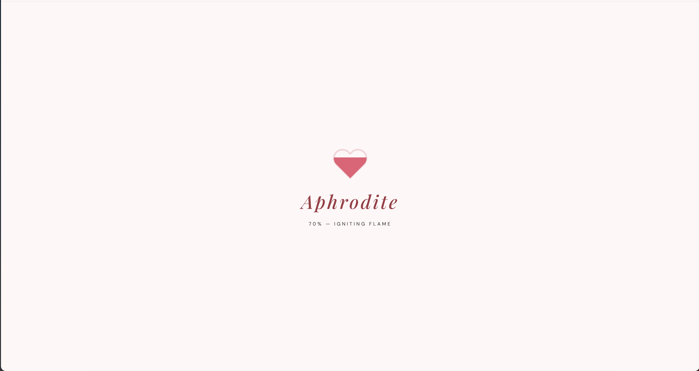
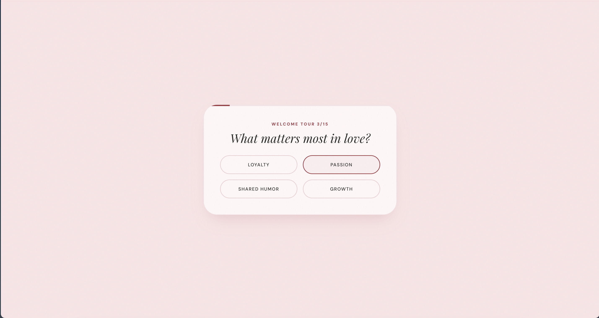
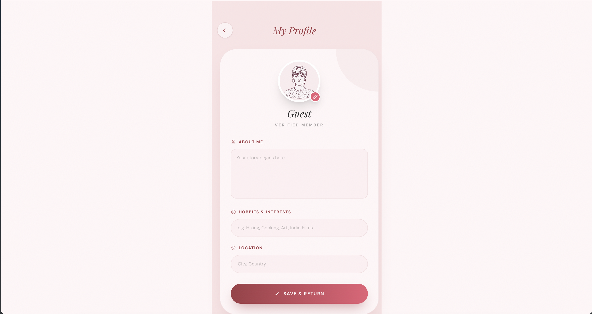

# Aphrodite

<div align="center">
  <h1 align="center">Aphrodite</h1>
  <p align="center">
    <strong>A next-generation dating app infused with the ancient art of FLAMES compatibility.</strong>
  </p>

  <p align="center">
    
    
    
    
    
  </p>

  <p align="center">
    <a href="#features">Features</a> •
    <a href="#tech-stack">Tech Stack</a> •
    <a href="#functionality--usage">Screenshots</a> •
    <a href="#getting-started">Getting Started</a>
  </p>
</div>

---

## 📖 Overview

**Aphrodite** merges modern swiping and profile discovery with the nostalgic FLAMES algorithm (Friends, Lovers, Affection, Marriage, Enemies, or Siblings) to redefine how we establish digital connections.

Say goodbye to endless surface-level matches. Aphrodite's unique compatibility score provides deep insights into the potential dynamic, building stronger and more meaningful foundations.

## ✨ Features

- **FLAMES Compatibility Engine:** A refined algorithm matching user bios and location for genuine relationship potential assessment.
- **Discover & Swiping:** intuitive swipe-to-match interface modeled for delight and ease.
- **Responsive App Experience:** Silky smooth, app-like navigation and transitions across devices.
- **Real-time Chatting:** Engage with your matches instantly built natively with Supabase subscriptions.
- **Dynamic Dashboard:** A centralized main hub tracking stats, matching, profile building, and ongoing conversations.
- **Secure Authentication:** Painless login and registration logic utilizing Supabase Auth and RLS.
- **Welcome Tour:** An interactive onboarding journey to guide new users to complete their profiles and understand the app.
- **Immersive UI/UX:** Elevated aesthetics featuring glassmorphism, blur gradients, parallax scrolls, and meticulous layout structuring.

## 📸 Functionality & Usage

### The Hero Section


<p align="center"><em>The stunning entry point of Aphrodite, welcoming the curious.</em></p>

### Loading Screen


<p align="center"><em>Immersive branded loading screen before entering the app.</em></p>

### Authentication


<p align="center"><em>Secure user login.</em></p>


<p align="center"><em>Swift and refined account creation.</em></p>

### Welcome Tour


<p align="center"><em>Interactive onboarding seamlessly guiding you into the ecosystem.</em></p>

### App Experience


<p align="center"><em>The central portal navigating to all of Aphrodite's features.</em></p>


<p align="center"><em>Browse potential matches in the Discover feed.</em></p>


<p align="center"><em>Discover potential relationships mapped to the FLAMES acronym.</em></p>


<p align="center"><em>Deep insight popups on compatibility matching.</em></p>


<p align="center"><em>Real-time instant messaging with your newly discovered matches.</em></p>


<p align="center"><em>Manage your digital identity, edit bios, and change your location seamlessly.</em></p>

---

## 🛠 Tech Stack

- **Framework**: React 18 with Vite
- **Language**: TypeScript
- **Styling**: Tailwind CSS
- **Backend/Auth/DB**: Supabase (PostgreSQL, GoTrue, Realtime)
- **Hosting**: Vercel

## 🚀 Getting Started

Follow these steps to set up the project locally.

### Installation

1. **Clone the repository**
   ```bash
   git clone https://github.com/yourusername/aphrodite.git
   cd aphrodite
   ```

2. **Install dependencies**
   ```bash
   npm install
   ```

3. **Configure Environment Variables**
   Create a `.env.local` file and add your Supabase credentials:
   ```env
   VITE_SUPABASE_URL="your-supabase-url"
   VITE_SUPABASE_ANON_KEY="your-supabase-anon-key"
   ```

4. **Run Development Server**
   ```bash
   npm run dev
   ```

## 📄 License

This project is licensed under the MIT License - see the LICENSE file for details.

---

<div align="center">
  <sub>Built with ❤️ by Shubham Upadhyay</sub>
</div>
